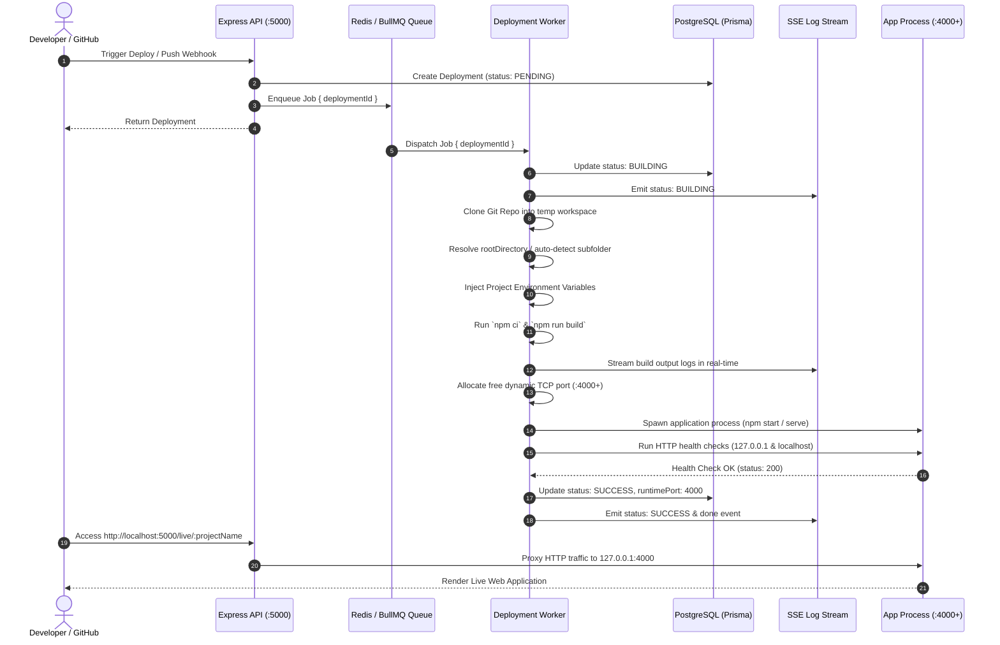

# DevDeploy Technical Architecture Deep Dive

This document details the internal architecture, design principles, and execution lifecycle of **DevDeploy**.

---

## 1. System Overview

DevDeploy is structured into four decoupled layers:
1. **Edge & Ingress Layer**: Express API server + built-in clean URL reverse proxy (`/live/:projectName`) and Cloudflare tunnel integration.
2. **Control Plane**: REST endpoints for authentication, project management, deployment orchestration, and environment variables.
3. **Queue & Message Bus**: Redis-backed BullMQ job queue ensuring asynchronous, fault-tolerant job processing with horizontal worker scalability.
4. **Execution Engine (Worker)**: Autonomous worker executing Git checkout, project structure inspection, monorepo subfolder resolution, dependency installation, dynamic build execution, and process lifecycle monitoring.

---

## 2. End-to-End Deployment Lifecycle

---

## 3. Core Engine Subsystems

### 3.1 Monorepo & Project Structure Auto-Detection
When a project lacks an explicit `rootDirectory` configuration, DevDeploy evaluates the repository tree:
1. If `package.json` or `index.html` exists at root `./`, it deploys the root.
2. If absent, it scans immediate subdirectories (ignoring hidden and build directories).
3. If candidate directories (such as `cric-frontend`, `frontend`, `client`, `web`) contain `package.json`, DevDeploy automatically selects the application folder and adjusts working directories for both build and runtime execution.

### 3.2 Dual-Mode Application Runtime
- **Node.js Servers**: Spawns npm start or custom commands with injected environment variables and dynamically mapped `$PORT`.
- **Static Single Page Apps (SPA)**: If build generates static assets (`dist/`, `build/`) without a backend server script, DevDeploy automatically runs an optimized static server (`npx serve -s dist -l $PORT`), ensuring client-side routing and assets function seamlessly.

### 3.3 Transparent Reverse Proxy
Mounted at `app.use("/live", createLiveProxyHandler)`:
- Extracts project names or numeric IDs from the request URL.
- Queries the PostgreSQL database for the project's most recent `SUCCESS` deployment.
- Rewrites headers (`host: localhost:<port>`, `x-forwarded-host`, `x-forwarded-for`) and streams HTTP request/response payloads to the assigned port with zero overhead.

### 3.4 Real-Time Log Broadcaster (SSE)
- Built on a lightweight in-memory `EventEmitter` singleton (`logEmitter`).
- When users open the live terminal in the UI, an `EventSource` connection is established at `GET /api/deployments/:id/logs/stream`.
- Historical logs are replayed upon connection, followed by instant, zero-delay broadcasts as child process `stdout` / `stderr` chunks are emitted by the worker.